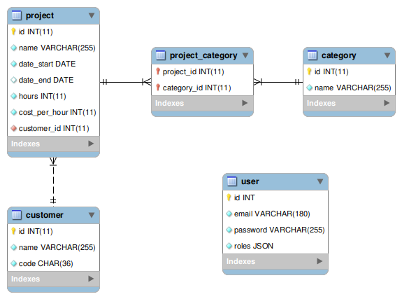

# Project Monitoring

## Présentation du projet

Ce projet a pour but de mettre en place un système permettant à des clients de
consulter le nombre d'heures passées sur un projet par une entreprise.

Chaque client peut consulter le nombre d'heures passées sur un projet en se
connectant à l'application web à l'aide d'un code unique (ils n'ont pas besoin
de créer de compte et de se connecter pour accéder à leurs données).

Un administrateur peut quant à lui ajouter des clients et des projets et
catégoriser les projets.

### Base de données

La base de données est composée de 3 tables principales :

- `customer` : Contient les informations des clients avec notamment leur code
  unique.
- `category` : Contient la liste des catégories de projet.
- `project` : Contient les informations des projets. Chaque projet peut être
  associé à plusieurs catégories et doit obligatoirement être associé à un et
  un seul client. Un projet contient également une date de début obligatoire
  ainsi qu'une date de fin optionnelle. Le champ `hours` permet de stocker le
  nombre d'heures passées sur le projet tandis que le champ `cost_per_hour`
  permet de stocker le coût par heure.



## Installation du projet

Pour faire fonctionner ce projet sur votre machine, vous devez commencer par
installer les dépendances du projet :

```shell
composer install
npm install
```

Vous devez ensuite créer le fichier .env.local et saisir les informations de
connexion à la base de données (ces données peuvent varier en fonction de votre
environnement de développement) :

```shell
DATABASE_URL="mysql://root:@127.0.0.1:3306/project_monitoring?serverVersion=5.7&charset=utf8mb4"
```

Vous devez ensuite créer la base de données et les tables et charger les
fixtures :

```shell
php bin/console doctrine:database:drop --force
php bin/console doctrine:database:create
php bin/console doctrine:migrations:migrate
php bin/console doctrine:fixtures:load
```

Vous pouvez ensuite lancer le serveur de développement et la compilation des
assets :

```shell
php -S localhost:8000 -t public
```

```shell
npm run watch
```

## Étapes suivies pour la création du projet

### Création du projet

[Documentation Symfony](https://symfony.com/doc/current/setup.html)

```shell
composer create-project symfony/skeleton:"6.2.*" project-monitoring
```

J'ai ensuite ouvert le projet dans PHPStorm et activé le plugin Symfony.

### Installation de webapp

Cette étape permet d'installer l'ensemble des dépendances couramment utilisées
dans un projet Symfony (Doctrine, Twig, Forms...).

```shell
composer require webapp
```

### Installation de apache-pack

Cette étape est optionnelle, mais permet de faire fonctionner l'application
pour les utilisateurs d'Apache.
Il faut bien penser à répondre "yes" à la question posée par le script.

[Documentation Symfony](https://symfony.com/doc/current/setup/web_server_configuration.html#adding-rewrite-rules)

```shell
composer require symfony/apache-pack
```

### Création des entités

J'ai ensuite créé les entités nécessaires au projet.
J'ai tout d'abord créé les entités `Project`, `Category` et `Customer` avec la commande suivante :

```shell
php bin/console make:entity
```

Puis j'ai ensuite créé l'entité User avec la commande suivante :

```shell
php bin/console make:user
```

Ensuite, j'ai configuré la connexion à la base de données dans le fichier `.env.local` :

```shell
DATABASE_URL="mysql://root:@127.0.0.1:3306/project_monitoring?serverVersion=5.7&charset=utf8mb4"
```

J'ai ensuite créé la base de données avec la commande suivante :

```shell
php bin/console doctrine:database:create
```

Enfin, j'ai généré puis exécuté les fichiers de migration avec les commandes suivantes :

```shell
php bin/console make:migration
php bin/console doctrine:migrations:migrate
```

### Création des fixtures

J'ai installé le bundle `DoctrineFixturesBundle` avec la commande suivante :

```shell
composer require --dev doctrine/doctrine-fixtures-bundle
```

J'ai ensuite supprimé le fichier `src/DataFixtures/AppFixtures.php` et créé un fichier de fixtures par entité Doctrine la commande suivante :

```shell
php bin/console make:fixtures
```

Après avoir créé les fixtures, j'ai exécuté la commande suivante pour les charger en base de données :

```shell
php bin/console doctrine:fixtures:load
```

### Configuration des assets

Pour ce projet, j'ai décidé d'utiliser Webpack Encore, SASS ainsi que
les librairies Bootstrap 5 et Font Awesome 5.

En utilisant Webpack Encore, je n'aurai pas besoin d'importer les fichiers
CSS ou JS qui seront automatiquement importés grâce aux lignes suivantes
déjà présentes dans le fichier `templates/base.html.twig` :

```twig

    {{ encore_entry_link_tags('app') }}



    {{ encore_entry_script_tags('app') }}

```

#### Installation de webpack encore

[Documentation Symfony](https://symfony.com/doc/current/frontend.html)

J'ai installé le bundle `Webpack Encore` pour gérer la compilation des assets
avec la commande suivante :

```shell
composer require symfony/webpack-encore-bundle
npm install
```

#### Mise en place de SASS

[Documentation Symfony](https://symfony.com/doc/current/frontend/encore/css-preprocessors.html)

J'ai renommé le fichier `assets/app.css` en `assets/app.scss` et j'ai modifié
le fichier `assets/app.js` pour importer le fichier `assets/app.scss` :

```javascript
// assets/app.js
import '../css/app.scss';
```

Ensuite, j'ai décommenté la ligne suivante dans le fichier `webpack.config.js`
pour activer la compilation des fichiers SASS :

```javascript
// webpack.config.js
.enableSassLoader()
```

Enfin, si on execute la commande `npm run watch` on obtient une erreur nous
indiquant d'installer sass-loader et sass (attention, la version de sass-loader
peut être différente) :

```shell
npm install sass-loader@^13.0.0 sass --save-dev
```

#### Installation de bootstrap

[Documentation Symfony](https://symfony.com/doc/current/frontend/encore/bootstrap.html)

J'ai commencé par installer Bootstrap avec la commande suivante :

```shell
npm install bootstrap
```

J'ai ensuite ajouté la ligne suivante dans le fichier `assets/app.scss` 
pour importer les styles de Bootstrap :

```scss
// assets/app.scss
@import '~bootstrap/scss/bootstrap';
```

J'ai volontairement omis d'importer les scripts de Bootstrap car je ne les
utiliserai pas dans ce projet, mais je vous invite à consulter la documentation
pour plus d'informations sur la mise en place du JS de Bootstrap.

##### Configuration des formulaires pour utiliser Bootstrap

[Documentation Symfony](https://symfony.com/doc/current/form/bootstrap5.html)

J'ai ensuite configuré les formulaires pour utiliser Bootstrap en modifiant le
fichier `config/packages/twig.yaml` :

```yaml
# config/packages/twig.yaml
twig:
    form_themes: ['bootstrap_5_layout.html.twig']
```

#### Installation de Font Awesome

[Documentation Symfony](https://symfony.com/doc/current/frontend/encore/fontawesome.html)

Pour l'installation de Font Awesome, j'ai tapé la commande suivante :

```shell
npm install @fortawesome/fontawesome-free
```

J'ai ensuite ajouté les lignes suivantes dans le fichier `assets/app.scss` :

```scss
// assets/app.scss
$fa-font-path: "~@fortawesome/fontawesome-free/webfonts";

@import "~@fortawesome/fontawesome-free/scss/fontawesome.scss";
@import "~@fortawesome/fontawesome-free/scss/regular.scss";
@import "~@fortawesome/fontawesome-free/scss/solid.scss";
```

### Création de la page d'accueil

La page d'accueil du site affichera simplement un formulaire qui permettra aux
clients d'accéder à leur espace perso en saisissant un code unique.

J'ai donc commencé par générer le controller de la page d'accueil en utilisant
la commande suivante :

```shell
php bin/console make:controller DefaultController
```

Cette commande permet de créer le fichier `src/Controller/DefaultController.php`
mais également le fichier `templates/default/index.html.twig` qui contiendra le
code HTML de la page d'accueil.

J'ai ensuite modifié le controller pour adapter le code généré par la commande :

```php
// src/Controller/DefaultController.php
#[Route('/', name: 'homepage')]
public function index(): Response
{
    return $this->render('default/index.html.twig');
}
```

Ensuite, j'ai souhaité afficher un formulaire sur la page d'accueil pour
rechercher un client en fonction de son code unique.

J'ai donc généré le formulaire en utilisant la commande suivante :

```shell
php bin/console make:form HomepageType
```

J'ai ensuite modifié ce fichier pour ne conserver que le champ 'code'.

Après cela, j'ai modifié de nouveau le controller pour envoyer le formulaire
à la vue :

```php
// src/Controller/DefaultController.php
#[Route('/', name: 'homepage')]
public function index(): Response
{
    $form = $this->createForm(HomepageType::class);

    return $this->render('default/index.html.twig', ['form' => $form->createView()]);
}
```

À noter que dans les prochaines version de Symfony, il ne sera plus nécessaire
d'appeler la méthode `createView()` sur le formulaire.

### Création de la page d'un client

J'ai généré le controller de la page d'un client en utilisant la commande
suivante :

```shell
php bin/console make:controller CustomerController
```

J'ai ensuite créé un formulaire Symfony pour afficher le formulaire de
la page d'accueil. Pour cela, j'ai utilisé la commande suivante :

```shell
php bin/console make:form HomepageType
```

Ce formulaire est un petit peu particulier, car il ne permettra pas de créer
un nouveau client en base de données, mais uniquement de rechercher un client
en fonction de son code unique.

J'ai donc modifié le fichier `src/Form/HomepageType.php` pour ne conserver que
le champ 'code' :

```php
// src/Form/HomepageType.php
$builder
    ->add('code')
;
```

J'ai ensuite modifié le controller de la page d'accueil pour envoyer le
formulaire à la vue :

```php
// src/Controller/DefaultController.php
#[Route('/', name: 'homepage')]
public function index(Request $request, CustomerRepository $customerRepository): Response
{
    $customer = new Customer();
    $form = $this->createForm(HomepageType::class, $customer);

    $form->handleRequest($request);

    // Si le formulaire a été validé, on redirige vers la page du client
    if ($form->isSubmitted() && $form->isValid()) {
        if ($customerRepository->findOneBy(['code' => $customer->getCode()])) {
            return $this->redirectToRoute('customer_show', ['code' => $customer->getCode()]);
        }

        $this->addFlash('danger', 'Le code client n\'existe pas.');
    }

    return $this->render('default/index.html.twig', ['form' => $form->createView()]);
}
```

Dans ce controller, j'ai également affiché un message flash dans le cas où le
code client n'existe pas en base de données.

J'ai ajouté le code suivant dans le fichier `templates/base.html.twig` pour
afficher les messages flash :

```twig
{# templates/base.html.twig #}

    <div class="container">
        
            
                <div class="alert alert-{{ label }} mt-2">
                    {{ message }}
                </div>
            
        
    </div>

```

Pour plus d'informations sur les messages flash, je vous invite à consulter la
[Documentation Symfony](https://symfony.com/doc/current/controller.html#flash-messages).

J'ai ensuite modifié le controller de la page d'un client pour afficher les
informations du client en fonction de son code unique :

```php
// src/Controller/CustomerController.php
#[Route('/customer/{code}', name: 'customer_show', methods: ['GET'])]
public function index(Customer $customer): Response
{
    return $this->render('customer/show.html.twig', [
        'customer' => $customer,
    ]);
}
```

Enfin, j'ai renommé puis modifié le fichier `templates/customer/show.html.twig`
pour afficher les informations du client.

### Création du dashboard de l'administration

J'ai généré le controller du dashboard de l'administration en utilisant la
commande suivante :

```shell
php bin/console make:controller Admin/DashboardController
```

J'ai ensuite créé le fichier `templates/admin/base.html.twig` pour avoir un
fichier de template de base pour l'administration. Ce fichier hérite lui-même
du fichier `templates/base.html.twig` et ajoute simplement un menu de navigation :

```twig
{# templates/admin/base.html.twig #}



    <nav class="navbar navbar-expand-lg sticky-top">
        ...
    </nav>

```

Ensuite j'ai modifié le fichier `templates/admin/dashboard/index.html.twig`
pour qu'il hérite du fichier `templates/admin/base.html.twig` :

```twig
{# templates/admin/dashboard/index.html.twig #}

```

Enfin, j'ai modifié le footer du site pour ajouter un lien vers l'administration :

```twig
{# templates/base.html.twig #}

    <footer>
        <div class="container">
            <hr>
            <p class="text-center">
                &copy; {{ 'now'|date('Y') }} - Project Monitoring -
                <a href="{{ path('admin_dashboard') }}">admin</a>
            </p>
        </div>
    </footer>

```

### Sécurisation de l'administration

Pour sécuriser les pages de l'administration, j'ai simplement décommenté la
ligne suivante dans le fichier `config/packages/security.yaml` :

```yaml
# config/packages/security.yaml
security:
    access_control:
         - { path: ^/admin, roles: ROLE_ADMIN }
```

### Création de la page de login

[Documentation Symfony](https://symfony.com/doc/current/security.html#form-login)

```shell
php bin/console make:controller Login
```

Modifier le fichier config/packages/security.yaml
pour ajouter le code suivant dans le main firewall :

```yaml
# config/packages/security.yaml
security:
    firewalls:
        main:
            form_login:
                login_path: app_login
                check_path: app_login
                enable_csrf: true
```

Modifier le controller LoginController :
```php
#[Route('/login', name: 'app_login')]
public function index(AuthenticationUtils $authenticationUtils): Response
{
    // Récupérer les erreurs du formulaire s'il y a des erreurs
    $error = $authenticationUtils->getLastAuthenticationError();

    // Récupérer le dernier email saisi
    $lastUsername = $authenticationUtils->getLastUsername();

    return $this->render('login/index.html.twig', [
        'error' => $error,
        'last_username' => $lastUsername,
    ]);
}
```

Modifier le fichier Twig templates/login/index.html.twig :
```twig

    
        <div>{{ error.messageKey|trans(error.messageData, 'security') }}</div>
    

    <form action="{{ path('app_login') }}" method="post">
        <label for="username">Email:</label>
        <input type="text" id="username" name="_username" value="{{ last_username }}">

        <label for="password">Password:</label>
        <input type="password" id="password" name="_password">

        {# If you want to control the URL the user is redirected to on success
        <input type="hidden" name="_target_path" value="/account"> #}

      <input type="hidden" name="_csrf_token" value="{{ csrf_token('authenticate') }}">
      
        <button type="submit">Login</button>
    </form>

```

### Création du CRUD de l'entité Project

Pour générer le CRUD de l'entité Project, j'ai utilisé la commande suivante :

```shell
php bin/console make:crud Project
```

J'ai ensuite modifié les fichiers générés pour utiliser les styles de Bootstrap
et corriger des erreurs au niveau des formulaires.
